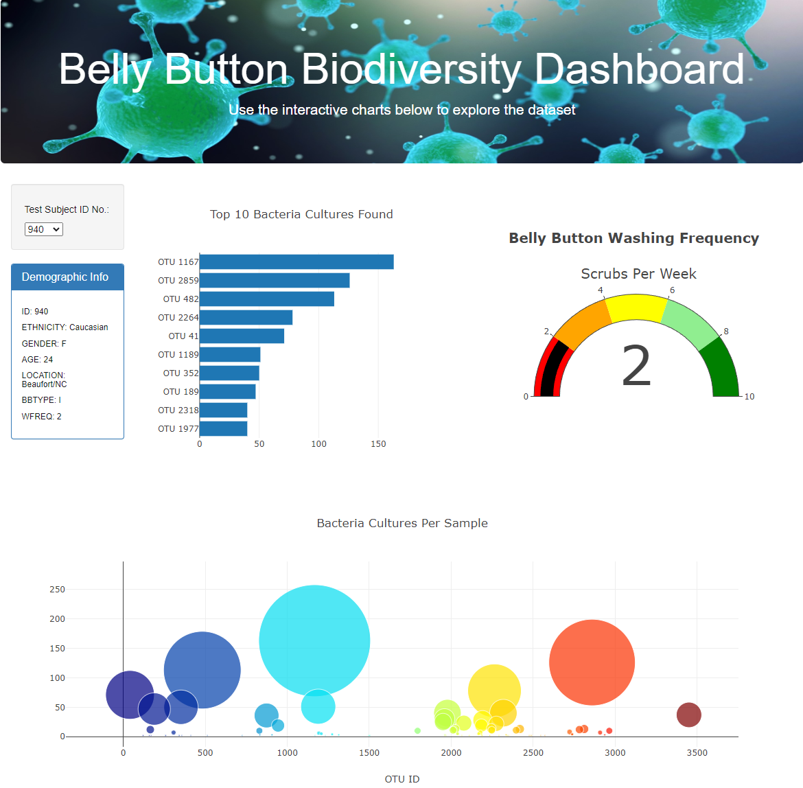

# belly_button
## Project Purpose
The purpose of this project was to create a dashboard that visualized belly button biodiversity data contained in a json file. The dashboard also allows the user to select to select which data to view by volunteer. This dashboard was created using javascript, plotly, D3, html and css.

## Project Results
This is a picture of the dashboard:

